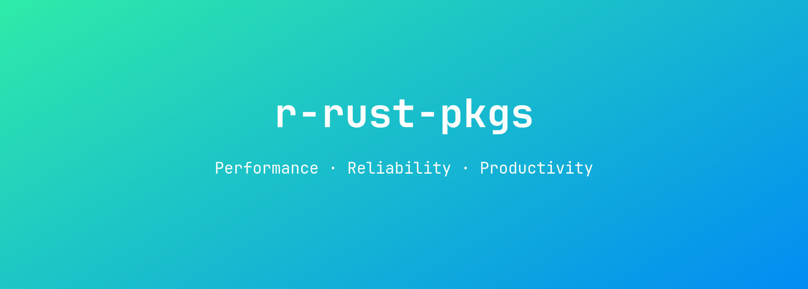

<!-- README.md is generated from README.Rmd. Please edit that file -->

# r-rust-pkgs

This is a list of all R packages using Rust on CRAN.

## A

- [arcgisgeocode](https://cran.r-project.org/package=arcgisgeocode) - A
  Robust Interface to ArcGIS ‘Geocoding Services’
- [arcgisplaces](https://cran.r-project.org/package=arcgisplaces) -
  Search for POIs using ArcGIS ‘Places Service’
- [arcgisutils](https://cran.r-project.org/package=arcgisutils) - ArcGIS
  Utility Functions
- [arcpbf](https://cran.r-project.org/package=arcpbf) - Process ArcGIS
  Protocol Buffer FeatureCollections
- [awdb](https://cran.r-project.org/package=awdb) - Query the USDA NWCC
  Air and Water Database REST API

## B

- [b64](https://cran.r-project.org/package=b64) - Fast and Vectorized
  Base 64 Engine

## C

- [caviarpd](https://cran.r-project.org/package=caviarpd) - Cluster
  Analysis via Random Partition Distributions
- [clarabel](https://cran.r-project.org/package=clarabel) - Interior
  Point Conic Optimization Solver

## F

- [fangs](https://cran.r-project.org/package=fangs) - Feature Allocation
  Neighborhood Greedy Search Algorithm
- [fcl](https://cran.r-project.org/package=fcl) - A Financial Calculator
- [fio](https://cran.r-project.org/package=fio) - Friendly Input-Output
  Analysis

## G

- [gifski](https://cran.r-project.org/package=gifski) - Highest Quality
  GIF Encoder

## H

- [heck](https://cran.r-project.org/package=heck) - Highly Performant
  String Case Converter
- [hellorust](https://cran.r-project.org/package=hellorust) - Minimal
  Examples of Using Rust Code in R

## P

- [prqlr](https://cran.r-project.org/package=prqlr) - R Bindings for the
  ‘prqlc’ Rust Library

## R

- [rbm25](https://cran.r-project.org/package=rbm25) - A Light Wrapper
  Around the ‘BM25’ ‘Rust’ Crate for Okapi BM25 Text Search
- [rextendr](https://cran.r-project.org/package=rextendr) - Call Rust
  Code from R using the ‘extendr’ Crate
- [rshift](https://cran.r-project.org/package=rshift) - Paleoecology
  Functions for Regime Shift Analysis
- [rtiktoken](https://cran.r-project.org/package=rtiktoken) - A
  Byte-Pair-Encoding (BPE) Tokenizer for OpenAI’s Large Language Models

## S

- [salso](https://cran.r-project.org/package=salso) - Search Algorithms
  and Loss Functions for Bayesian Clustering
- [smcryptoR](https://cran.r-project.org/package=smcryptoR) -
  ShangMi(SM) Cryptographic Algorithms(SM2/SM3/SM4)
- [SQLFormatteR](https://cran.r-project.org/package=SQLFormatteR) -
  Format SQL Queries
- [string2path](https://cran.r-project.org/package=string2path) -
  Rendering Font into ‘data.frame’

## T

- [tergo](https://cran.r-project.org/package=tergo) - Style Your Code
  Fast
- [tomledit](https://cran.r-project.org/package=tomledit) - Parse, Read,
  and Edit ‘TOML’

## Y

- [ymd](https://cran.r-project.org/package=ymd) - Parse ‘YMD’ Format
  Number or String to Date

## Z

- [zoomerjoin](https://cran.r-project.org/package=zoomerjoin) -
  Superlatively Fast Fuzzy Joins
