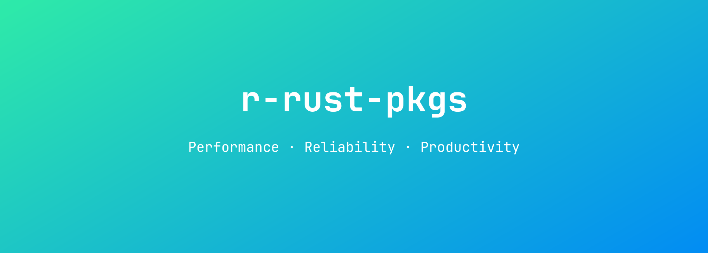

<!-- README.md is generated from README.Rmd. Please edit that file -->

# r-rust-pkgs

This is a list of all R packages using Rust on CRAN.

## A

- [a5R](https://cran.r-project.org/package=a5R) - ‘A5’ Discrete Global
  Grid System
- [ahocorasick](https://cran.r-project.org/package=ahocorasick) - Fast
  Multi-Pattern String Matching with the ‘Aho-Corasick’ Algorithm
- [arcgis](https://cran.r-project.org/package=arcgis) - ArcGIS Location
  Services Meta-Package
- [arcgisgeocode](https://cran.r-project.org/package=arcgisgeocode) - A
  Robust Interface to ArcGIS ‘Geocoding Services’
- [arcgisplaces](https://cran.r-project.org/package=arcgisplaces) -
  Search for POIs using ArcGIS ‘Places Service’
- [arcgisutils](https://cran.r-project.org/package=arcgisutils) -
  R-ArcGIS Bridge Utility Functions
- [arcpbf](https://cran.r-project.org/package=arcpbf) - Process ArcGIS
  Protocol Buffer FeatureCollections
- [astgrepr](https://cran.r-project.org/package=astgrepr) - Parse and
  Manipulate R Code
- [automerge](https://cran.r-project.org/package=automerge) - R Bindings
  for ‘Automerge’ ‘CRDT’ Library
- [awdb](https://cran.r-project.org/package=awdb) - Query the USDA NWCC
  Air and Water Database REST API

## B

- [b32](https://cran.r-project.org/package=b32) - Fast and Vectorized
  Base32 Encoding
- [b64](https://cran.r-project.org/package=b64) - Fast and Vectorized
  Base 64 Engine

## C

- [caugi](https://cran.r-project.org/package=caugi) - Causal Graph
  Interface
- [caviarpd](https://cran.r-project.org/package=caviarpd) - Cluster
  Analysis via Random Partition Distributions
- [ciflyr](https://cran.r-project.org/package=ciflyr) -
  Reachability-Based Primitives for Graphical Causal Inference
- [clarabel](https://cran.r-project.org/package=clarabel) - Interior
  Point Conic Optimization Solver

## D

- [datefixR](https://cran.r-project.org/package=datefixR) - Standardize
  Dates in Different Formats or with Missing Data

## E

- [enderecobr](https://cran.r-project.org/package=enderecobr) -
  Padronizador de Endereços Brasileiros (Brazilian Addresses
  Standardizer)
- [eulerr](https://cran.r-project.org/package=eulerr) -
  Area-Proportional Euler and Venn Diagrams with Ellipses

## F

- [fangs](https://cran.r-project.org/package=fangs) - Feature Allocation
  Neighborhood Greedy Search Algorithm
- [fastgeojson](https://cran.r-project.org/package=fastgeojson) -
  High-Performance ‘GeoJSON’ and ‘JSON’ Serialization
- [fcl](https://cran.r-project.org/package=fcl) - A Financial Calculator
- [fibr](https://cran.r-project.org/package=fibr) - Prior-Fraction
  Diagnostics for Hierarchical Models
- [fio](https://cran.r-project.org/package=fio) - Friendly Input-Output
  Analysis
- [fozziejoin](https://cran.r-project.org/package=fozziejoin) -
  Utilities for Joining Dataframes with Inexact Matching
- [freestiler](https://cran.r-project.org/package=freestiler) - Create
  Vector Tiles from Spatial Data
- [fru](https://cran.r-project.org/package=fru) - A Blazing Fast
  Implementation of Random Forest

## G

- [gadjid](https://cran.r-project.org/package=gadjid) - Graph Adjustment
  Identification Distances for Causal Graphs
- [gglinedensity](https://cran.r-project.org/package=gglinedensity) -
  Make DenseLines Heatmaps with ‘ggplot2’
- [ggsql](https://cran.r-project.org/package=ggsql) - Grammar of
  Graphics for SQL
- [gifski](https://cran.r-project.org/package=gifski) - Highest Quality
  GIF Encoder
- [gtfsrealtime](https://cran.r-project.org/package=gtfsrealtime) - Read
  GTFS-Realtime Files into Data Frames

## H

- [h3o](https://cran.r-project.org/package=h3o) - H3 Geospatial Indexing
  System
- [heck](https://cran.r-project.org/package=heck) - Highly Performant
  String Case Converter
- [hellorust](https://cran.r-project.org/package=hellorust) - Minimal
  Examples of Using Rust Code in R

## L

- [libipldr](https://cran.r-project.org/package=libipldr) - R Bindings
  to the ‘Rust’ ‘IPLD’ Library
- [llmjson](https://cran.r-project.org/package=llmjson) - Repair
  Malformed JSON Strings

## M

- [ml](https://cran.r-project.org/package=ml) - Supervised Learning with
  Mandatory Splits and Seeds
- [mx.crypto](https://cran.r-project.org/package=mx.crypto) - Matrix
  End-to-End Encryption Primitives

## N

- [nirs4alldatasets](https://cran.r-project.org/package=nirs4alldatasets) -
  Acquire Curated NIRS Reference Datasets (‘nirs4all-datasets’)

## O

- [orbweaver](https://cran.r-project.org/package=orbweaver) - Fast and
  Efficient Graph Data Structures

## P

- [pdfsigner](https://cran.r-project.org/package=pdfsigner) - Digitally
  Sign and Verify PDF Documents
- [prqlr](https://cran.r-project.org/package=prqlr) - R Bindings for the
  ‘prqlc’ Rust Library

## R

- [rbm25](https://cran.r-project.org/package=rbm25) - A Light Wrapper
  Around the ‘BM25’ ‘Rust’ Crate for Okapi BM25 Text Search
- [rextendr](https://cran.r-project.org/package=rextendr) - Build ‘Rust’
  Powered ‘R’ Packages
- [roxigraph](https://cran.r-project.org/package=roxigraph) - ‘RDF’ and
  ‘SPARQL’ for R using ‘Oxigraph’
- [RPesto](https://cran.r-project.org/package=RPesto) - Phylogenetic
  Estimation of Shifts in the Tempo of Origination
- [rsamplr](https://cran.r-project.org/package=rsamplr) - Sampling
  Algorithms and Spatially Balanced Sampling
- [rshift](https://cran.r-project.org/package=rshift) - Paleoecology
  Functions for Regime Shift Analysis
- [rtiktoken](https://cran.r-project.org/package=rtiktoken) - A
  Byte-Pair-Encoding (BPE) Tokenizer for OpenAI’s Large Language Models

## S

- [salso](https://cran.r-project.org/package=salso) - Search Algorithms
  and Loss Functions for Bayesian Clustering
- [sceua](https://cran.r-project.org/package=sceua) - Shuffled Complex
  Evolution Algorithm for Optimization
- [smoothbp](https://cran.r-project.org/package=smoothbp) - Hierarchical
  Piecewise Regression with Smoothed Change-Points
- [socratadata](https://cran.r-project.org/package=socratadata) -
  Explore Socrata Data with Ease
- [spopt](https://cran.r-project.org/package=spopt) - Spatial
  Optimization for Regionalization, Facility Location, and Market
  Analysis
- [SQLFormatteR](https://cran.r-project.org/package=SQLFormatteR) -
  Format SQL Queries

## T

- [tergo](https://cran.r-project.org/package=tergo) - Style Your Code
  Fast
- [tinyimg](https://cran.r-project.org/package=tinyimg) - Optimize and
  Compress Images
- [tok](https://cran.r-project.org/package=tok) - Fast Text Tokenization
- [tomledit](https://cran.r-project.org/package=tomledit) - Parse, Read,
  and Edit ‘TOML’

## U

- [unsum](https://cran.r-project.org/package=unsum) - Reconstruct Raw
  Data from Summary Statistics
- [uuidx](https://cran.r-project.org/package=uuidx) - Modern UUIDs for R
  with a Rust Backend

## W

- [waysign](https://cran.r-project.org/package=waysign) - Multi-Purpose
  and High-Performance Routing

## X

- [xactonomial](https://cran.r-project.org/package=xactonomial) -
  Inference for Functions of Multinomial Parameters

## Y

- [yaml12](https://cran.r-project.org/package=yaml12) - Fast ‘YAML’ 1.2
  Parser and Formatter
- [ymd](https://cran.r-project.org/package=ymd) - Parse ‘YMD’ Format
  Number or String to Date

## Z

- [zoomerjoin](https://cran.r-project.org/package=zoomerjoin) -
  Superlatively Fast Fuzzy Joins
